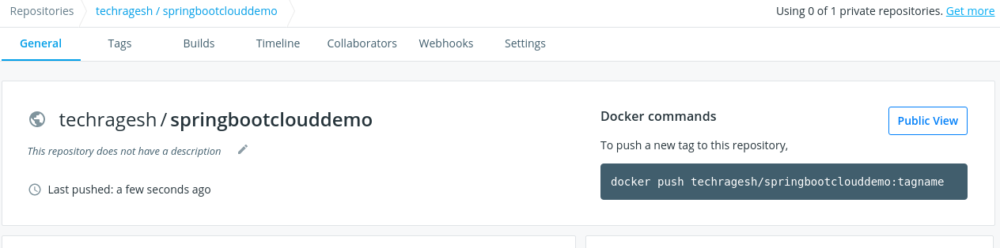
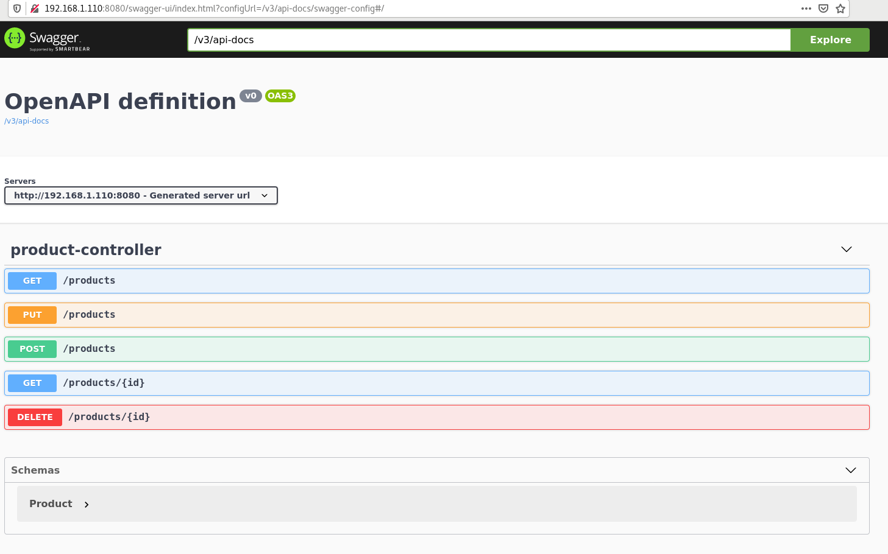
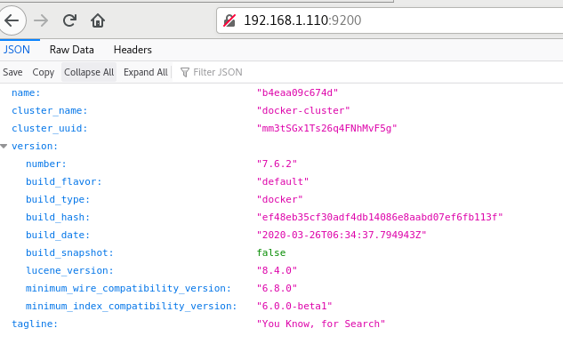
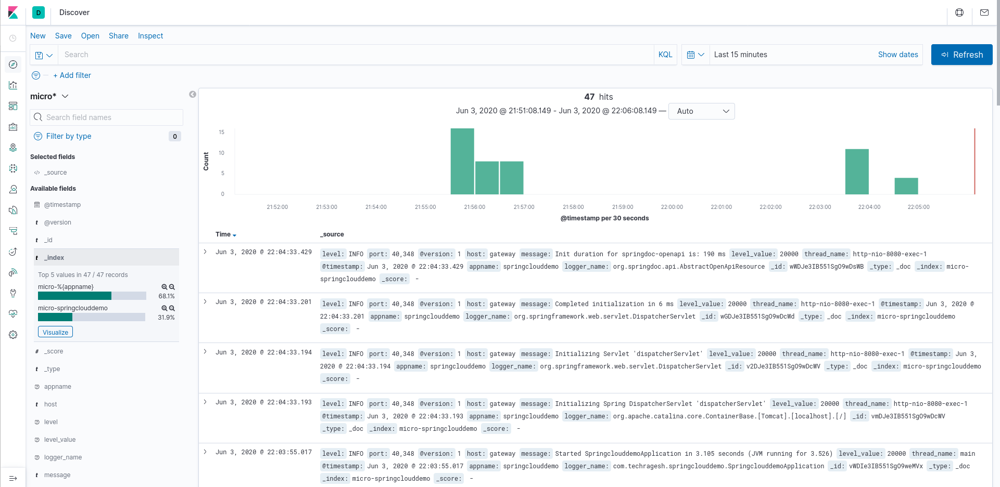

# springboot-elk-logstash-kibana
This project explain how to access application logs in kibana using elasticsearch with help of logstash


#### Pre-requisites

**_Create Docker Network_**

```
docker network create micro
docker network ls
```

**_Install Elasticsearch using docker:_**

```
docker run -d --name elasticsearch --net micro -p 9200:9200 -p 9300:9300 -e "discovery.type=single-node" elasticsearch:7.6.2
```

**_Install LogStash using docker:_**

```
docker run -d --name logstash --net micro -p 5000:5000 -v ~/logstash.conf:/usr/share/logstash/pipeline/logstash.conf docker.elastic.co/logstash/logstash:7.6.2
```

**Note:** You need to create a logstash.conf file before in your home folder

**logstash.conf**

```
input {
  tcp {
    port => 5000
    codec => json
  }
}
output {
  elasticsearch {
    hosts => ["http://elasticsearch:9200"]
    index => "micro-%{appname}"
  }
}

```

**_Install Kibana using docker:_**

```
docker run -d --name kibana --net micro -e "ELASTICSEARCH_URL=http://elasticsearch:9200" -p 5601:5601 docker.elastic.co/kibana/kibana:7.6.2
```

#### Application build and deployment

This is a simple spring boot application, I used google cloud jib plugin to build docker image and push into docker hub

* **Important Notes:**

    1. Change your IP Address in the logback-spring.xml under <destination> element.
    2. Add spring.output.ansi.enabled: always in application.yaml

* **jib plugin to build docker image**

```
<plugin>
    <groupId>com.google.cloud.tools</groupId>
    <artifactId>jib-maven-plugin</artifactId>
	<version>2.1.0</version>
	<configuration>
        <to>techragesh/springbootclouddemo</to>
    </configuration>
</plugin>

```

* **Command to build docker image and push into docker hub**

```
mvn compile jib:build

```




**_Run the application using docker image:_**

```
docker run -d --name springbootclouddemo --net micro -p 8080:8080 techragesh/springbootclouddemo

```

**_Swagger URL to run the application_**

```
http://IP Address:8080/swagger-ui/index.html?configUrl=/v3/api-docs/swagger-config
```

### Screenshots








### Happy Coding
